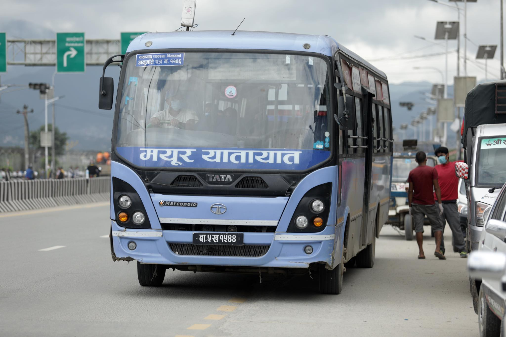
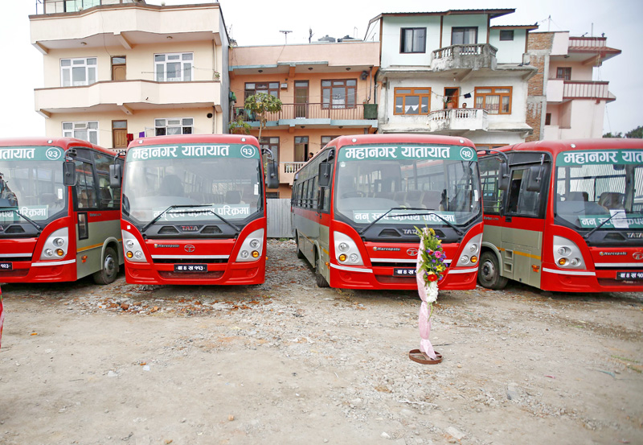
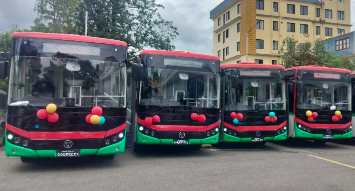
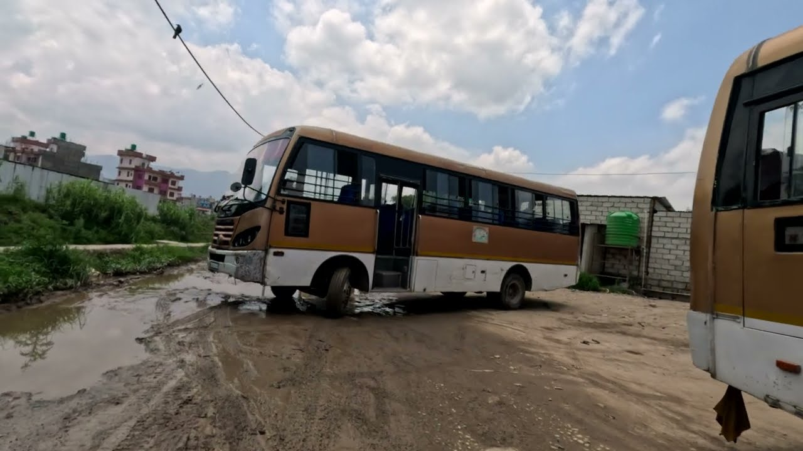
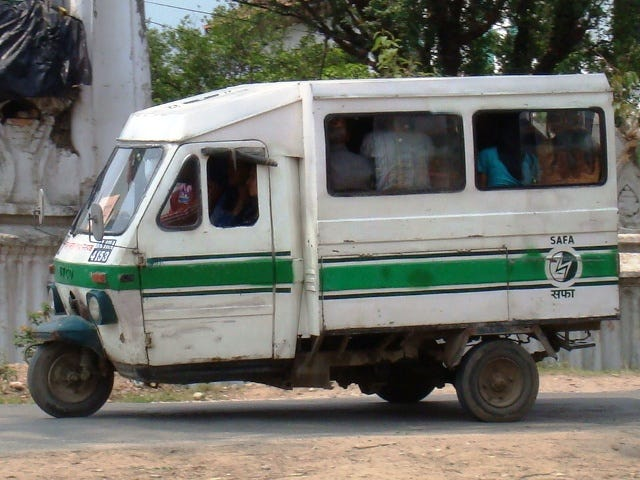

<p align="center">
  
</p>

<h1 align="center">Sawari — Kathmandu Valley Public Transit</h1>

<p align="center">
  <strong>AI-powered transit navigation · Live vehicle tracking · Community-driven data</strong><br/>
  <em>Team Spark — AI Hackathon</em>
</p>

<p align="center">
  
  
  
  
</p>

---

## What Is Sawari?

**Sawari** (सवारी — "ride" in Nepali) is a public transit navigation app for Kathmandu Valley. Think of it like Google Maps, but specifically built for Nepal's bus and microbus network.

Getting around Kathmandu by bus is confusing — dozens of routes, no official app, and unless you already know which bus to take, you're stuck asking strangers or taking a taxi. Sawari fixes that.

### How It Works

1. **Open the app** in your browser — no download needed
2. **Tell it where you want to go** — type a place name, tap the map, or say "take me from Ratnapark to Lagankhel"
3. **Get your route** — which bus, where to board, where to get off, and transfers if needed
4. **See the fare** — DoTM tariff-based, with student/elderly discounts
5. **Track buses live** — see where your bus is right now on the map

---

## Key Features

### 🧠 AI-Powered Navigation

Natural language input — "Bagbazar to Basundhara". Groq LLM extracts locations, finds the best route including transfers. Walking directions for the first and last mile.

### 💰 Fare Calculator

Nepal DoTM tariff rates, bus vs microbus fare ranges, student/elderly discounts (~25% off), rounded to realistic Rs 5 increments.

### 📡 Live Vehicle Tracking

Real-time positions polled every 3 seconds with smooth animated movement (cubic easing). Nearest vehicles assigned to journey legs with ETA estimates.

### 🌱 Carbon Savings

CO₂ comparison — car (170 g/km) vs bus (50 g/km). Shows grams or kilograms saved per trip.

### 📍 GPS Integration

Real-time tracking, compass heading, accuracy circle, nearby stops discovery, one-tap "Use as Start".

### 🚧 Obstruction Awareness

Backend route planning avoids active road blockages. OSRM alternatives scored against obstruction positions.

### ⭐ Rating System

Rate routes and vehicles 1–5 stars. Running averages maintained server-side.

### 💬 AI Chatbot

Groq-powered Llama 3.3 70B chatbot on the landing page for transit Q&A.

### 💡 Community Suggestions

Submit route corrections or missing stops. AI extracts structured tasks for one-click admin approval.

---

## Project Structure

```
Ai-Hackathon-team-spark-/
├── app/                        # Main web application
│   ├── index.php               # Public navigator (entry point)
│   ├── app.js                  # Navigator JavaScript
│   ├── routing.js              # Route-finding logic
│   ├── style.css               # Navigator styles
│   ├── admin/                  # Admin dashboard
│   │   ├── index.php           # Admin entry point
│   │   └── (12+ IIFE JS modules)
│   ├── backend/
│   │   ├── handlers/
│   │   │   ├── api.php         # Public API
│   │   │   └── suggestions.php # Suggestions API + AI task extraction
│   │   └── admin/
│   │       ├── handlers/api.php
│   │       ├── validators/     # Per-entity validation
│   │       ├── services/       # RelationGuard (referential integrity)
│   │       └── repositories/   # FileStore (JSON + LOCK_EX)
│   ├── data/                   # JSON data files
│   │   ├── stops.json
│   │   ├── routes.json
│   │   ├── vehicles.json
│   │   ├── obstructions.json
│   │   └── suggestions.json
│   └── hardware-api/           # ESP32 upload endpoint
├── sawari_telemetry/           # ESP32 GPS telemetry firmware
│   ├── sawari_telemetry.ino    # Main sketch
│   ├── config.h                # Configuration
│   ├── gps_handler.*           # NEO-8M GPS module
│   ├── network_handler.*       # WiFi + API communication
│   ├── display_handler.*       # OLED display
│   ├── led_handler.*           # LED status indicators
│   └── storage_handler.*       # Offline data buffering
├── sawari_cam/                 # ESP32-CAM camera firmware
│   ├── sawari_cam.ino          # Main sketch
│   └── config.h                # Configuration
├── esp32_cam_portal/           # ESP32-CAM captive portal (OV3660)
│   └── esp32_cam_portal.ino    # Full portal with recording + upload
├── landing.php                 # Landing page
├── landing.css                 # Landing page styles
├── landing.js                  # Landing page JS (chatbot, suggestions)
├── presentation.html           # HTML presentation (all features + gallery)
├── gallery/                    # Transit photographs
├── logo/                       # Brand assets
├── docs/                       # Documentation
│   ├── overview.md             # What is Sawari
│   ├── features.md             # Complete feature list (80+ features)
│   ├── tech-stack.md           # Architecture & data flow
│   ├── hardware.md             # ESP32-CAM hardware docs
│   └── GPS_TELEMETRY_DOCUMENTATION.md
└── sawari.pptx                 # PowerPoint presentation
```

---

## Architecture

```
┌─────────────────────────────────────────────────────────────┐
│                      CLIENT  (Browser)                      │
│                                                             │
│  ┌─────────────────────┐    ┌────────────────────────────┐  │
│  │   Public Navigator  │    │    Admin Dashboard         │  │
│  │   Leaflet + JS      │    │    12+ IIFE JS modules     │  │
│  │   routing.js        │    │    AI Assistant (Groq)     │  │
│  └────────┬────────────┘    └──────────┬─────────────────┘  │
│           │ fetch()                    │ fetch()             │
└───────────┼────────────────────────────┼────────────────────┘
            ▼                            ▼
┌───────────────────────┐    ┌────────────────────────────────┐
│  Public API  (PHP)    │    │  Admin API  (PHP)              │
│  api.php              │    │  validators / relation-guard   │
│  suggestions.php      │    │  file-store (JSON + LOCK_EX)  │
└───────────┬───────────┘    └──────────┬─────────────────────┘
            ▼                            ▼
┌─────────────────────────────────────────────────────────────┐
│        data/*.json  (stops, routes, vehicles, etc.)         │
└─────────────────────────────────────────────────────────────┘

External APIs: OSRM Routing · Nominatim Geocoding · Groq LLM (Llama 3.3 70B)

┌──────────────────────────────────────┐
│          IoT Hardware Layer          │
│  ESP32 GPS Telemetry → API → data/  │
│  ESP32-CAM → Image Upload → API     │
└──────────────────────────────────────┘
```

---

## Tech Stack

| Layer | Technology | Details |
|-------|-----------|---------|
| **Frontend** | Vanilla JavaScript (ES2020+) | No frameworks, no bundlers. IIFE module pattern |
| **Maps** | Leaflet 1.9.4 | CARTO basemaps, dark/light themes |
| **Icons** | Font Awesome 6.5.1 | UI icons and stop markers |
| **Backend** | PHP 8+ | LAMP stack (XAMPP), session auth |
| **Storage** | JSON flat files | No database — `LOCK_EX` for concurrency |
| **AI** | Groq Cloud (Llama 3.3 70B) | Navigation, chatbot, admin assistant, task extraction |
| **Routing** | OSRM | Road-snapped polylines with alternatives |
| **Geocoding** | Nominatim | Place name → coordinates |
| **IoT** | ESP32 + NEO-8M GPS | Bus fleet telemetry |
| **Camera** | ESP32-CAM (OV3660) | Captive portal + recording + upload |

---

## Public Navigator Features

- Set start/end by clicking the map, typing, or natural language
- Direct and transfer route finding
- OSRM road-snapped polylines with direction arrows
- Draggable markers, swap, clear all
- Multi-candidate stop search (800m radius)
- Walking fallback as last resort
- DoTM tariff fare calculation with student/elderly discounts
- CO₂ savings display (car vs bus comparison)
- Live vehicle tracking (3-second polling, smooth animation)
- Vehicle assignment to journey legs with ETA
- Route and vehicle rating (1–5 stars)
- Local + Nominatim autocomplete with LRU cache
- Explore all routes — filter, click to highlight
- GPS tracking with compass, nearby stops, one-tap start
- Dark / Light theme with matched tile layers
- Keyboard shortcuts: `/` `?` `Enter` `Esc` `T` `E` `G` `N`
- Responsive layout (mobile, tablet, desktop)
- Toast notifications, skeleton loading, stats bar

---

## Admin Dashboard Features

- **Auth**: Password-based login via `.env`, PHP sessions
- **Workspace**: Command bar, layer panel, map canvas, inspector, status strip
- **Stops**: CRUD with FontAwesome/image icons, color picker, dependency checks
- **Routes**: Multi-step builder, drag-reorder, snap to road, style controls
- **Vehicles**: Assign to routes, image upload, moving state, bearing
- **Obstructions**: Create with radius and severity (low/medium/high)
- **AI Assistant**: `Ctrl+I` — NL entity CRUD, batch actions, confirmation cards
- **Undo / Redo**: Command pattern, `Ctrl+Z` / `Ctrl+Y`
- **Search**: `Ctrl+K` — search across all entities
- **Community Suggestions**: AI-extracted tasks, approve/dismiss, category coding
- **Layer Management**: Toggle visibility, quick filters, entity counts

---

## IoT Hardware

### GPS Telemetry Device (`sawari_telemetry/`)

An ESP32-based GPS tracker designed for bus fleet tracking:

| Component | Specification |
|-----------|--------------|
| MCU | ESP32 Dev Module (38-pin) |
| GPS | NEO-8M (multi-GNSS, 2.0m accuracy) |
| Display | 1.3" OLED (SH1106/SSD1306, I2C) |
| Power | 12V vehicle → buck converter → 5V |
| LEDs | Power (green), WiFi (blue), GPS (yellow), Data (red) |
| Data Rate | 1 update every 2 seconds |
| Offline Buffer | 500 records (~100KB) |

**Libraries**: TinyGPSPlus, U8g2, WiFiManager

### Bus Camera System (`esp32_cam_portal/`)

ESP32-CAM (OV3660) captive portal for onboard video:

- AP name: `bus#1`, auto captive redirect to `1.2.3.4`
- Live camera feed + SD card recording (10-second MJPEG segments)
- Auto upload: 1 image per minute to API endpoint
- Web UI: live feed, playback, flash control, debug console, Wi-Fi scan
- Runtime tuning via web UI (segment duration, cleanup threshold)
- Auto storage cleanup at 90% SD usage

**Board**: AI Thinker ESP32-CAM, PSRAM enabled, 240 MHz

---

## API Endpoints

### Public API (`backend/handlers/api.php`)

| Method | Endpoint | Description |
|--------|----------|-------------|
| GET | `?type=stops` | List all stops |
| GET | `?type=routes` | List all routes |
| GET | `?type=vehicles` | List all vehicles |
| GET | `?type=obstructions` | List all obstructions |
| POST | `?type=route-plan` | Obstruction-aware route planning |

### Suggestions API (`backend/handlers/suggestions.php`)

| Method | Description |
|--------|-------------|
| GET | List all suggestions |
| POST | Submit suggestion + AI task extraction |
| PUT | Update suggestion status |
| DELETE | Delete suggestion |

### Admin API (`backend/admin/handlers/api.php`)

Full CRUD with server-side validation, dependency checks, image upload (10MB limit), and force delete with cascade detach.

---

## Getting Started

### Prerequisites

- XAMPP (Apache + PHP 8+)
- A browser
- (Optional) Arduino IDE for IoT firmware

### Setup

```bash
# 1. Clone into XAMPP htdocs
git clone https://github.com/your-repo/Ai-Hackathon-team-spark-.git htdocs/sawari/

# 2. Create environment file
cp app/.env.example app/.env
# Edit app/.env:
#   ADMIN_PASSWORD=sawari@111
#   GROQ_API_KEY=your_groq_key_here

# 3. Start Apache in XAMPP

# 4. Open in browser
#    Public:  http://localhost/sawari/app/
#    Admin:   http://localhost/sawari/app/admin/
#    Landing: http://localhost/sawari/landing.php
```

No build step. No npm install. No compilation needed.

### IoT Firmware Upload

**GPS Telemetry:**
1. Install ESP32 board support + TinyGPSPlus, U8g2, WiFiManager
2. Edit `sawari_telemetry/config.h` with your bus ID and API endpoint
3. Board: ESP32 Dev Module → Upload

**Bus Camera:**
1. Install ESP32 board support
2. Board: AI Thinker ESP32-CAM, PSRAM Enabled, Huge APP partition
3. Upload `esp32_cam_portal/esp32_cam_portal.ino`

---

## Data Coverage

Sawari covers major routes in Kathmandu Valley including operators like:
- Nepal Yatayat
- Mahanagar Yatayat
- Sajha Yatayat
- Mayur Yatayat
- Samakhusi Yatayat

Routes span from Thankot to Dhulikhel, Lagankhel to Budhanilkantha, and many more across the valley.

---

## Documentation

| Document | Description |
|----------|-------------|
| [docs/overview.md](docs/overview.md) | What is Sawari — full product overview |
| [docs/features.md](docs/features.md) | Complete feature list (80+ features) |
| [docs/tech-stack.md](docs/tech-stack.md) | Architecture, data flow, and system workflow |
| [docs/hardware.md](docs/hardware.md) | ESP32-CAM hardware documentation |
| [docs/GPS_TELEMETRY_DOCUMENTATION.md](docs/GPS_TELEMETRY_DOCUMENTATION.md) | GPS module, NMEA, telemetry pipeline |
| [sawari_telemetry/README.md](sawari_telemetry/README.md) | Telemetry device assembly guide |
| [presentation.html](presentation.html) | Interactive HTML presentation |

---

## Gallery

<p align="center">
  
  
  
</p>
<p align="center">
  
  
  
</p>

> See all 34 images in the [`gallery/`](gallery/) folder or view the [presentation](presentation.html).

---

## License

See [LICENSE](LICENSE) for details.

---

<p align="center">
  <strong>Sawari</strong> — making Kathmandu Valley transit accessible, smart, and community-driven.<br/>
  <em>Team Spark · AI Hackathon</em>
</p>
